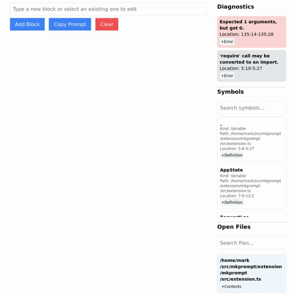
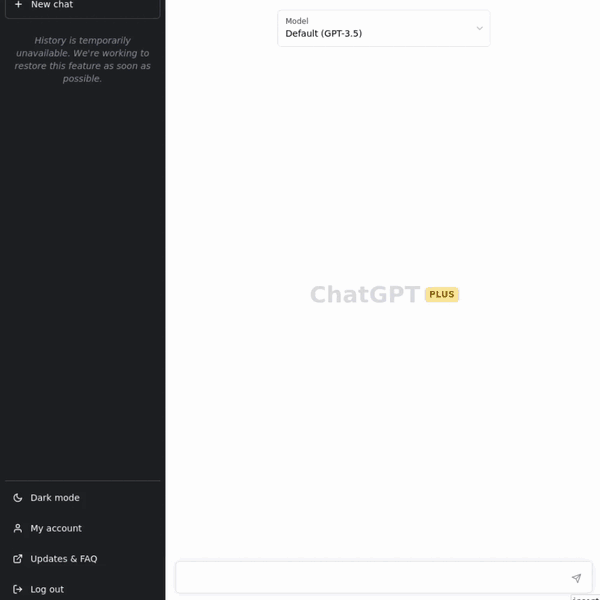

# MkPrompt

MkPrompt is a prompt builder for ChatGPT and other similar apps. It lets you take code, definitions, and errors from a running VSCode instance and constructs a prompt that can be copied and pasted into an LLM interface.

First, construct the prompt using a mix of VSCode blocks and custom text input:



Then, copy the nicely formatted prompt and paste into the tool of your choice!



Reasons why this is useful:
- LLM neutral: paste prompts into ChatGPT, Claude, Bing Chat, Bard, etc. Don't double pay for a subscription to a second tool.
- Easily search for defined files and symbols
- No need to fiddle with copy/pasting error messages or definitions
- Free Software under AGPLv3. Contact for alternative licensing.
- Runs fully locally; no telemetry or tracking, works on intranet.

## Running
Requirements: VSCode, Docker

1. Download the VSCode extension [here](https://marketplace.visualstudio.com/items?itemName=TextQL.mkprompt)
2. Clone this repo and run `make run`. Alternately, directly run the docker image:
```
docker pull ahaym/mkprompt:latest
docker run -it --rm -p 4080:4080 ahaym/mkprompt:latest
```
(Commands may need to be run as `sudo`/administrator)

3. In VSCode, Ctrl-Shift-P and run "Connect to MkPrompt Web App"
4. Navigate to localhost:4080 and start building prompts!

## Architecture
Three parts:
1. VSCode extension that sends symbols, diagnostics, and open files to the server over both REST and Websockets.
2. Haskell Server that talks with the VSCode extension and serves the static frontend.
3. Static frontend in SvelteKit.

They live in `extension/`, `backend/`, and `frontend/` respectively.

For production, the backend and frontend are packaged together with nix (see `flake.nix`) and turned into a Docker image, though they can also be run separately. The extension is packaged the normal way with `vsce`.

## Contributions

Contributions welcome. TextQL, Inc. reserves the right to release the code in this repository under a commercial license in addition to the AGPLv3 license outlined here.

## Contact

mark [at-symbol] textql [period] com
